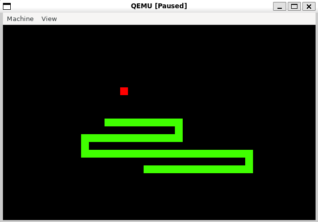
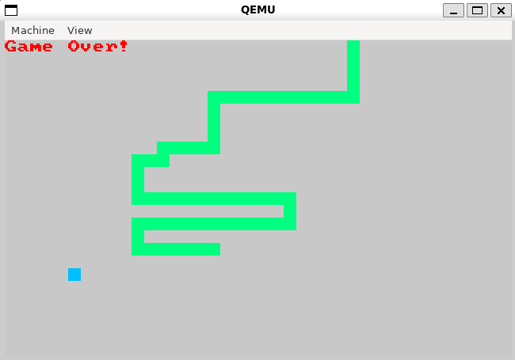

# BootSnake

## Information

This project implements a Bootsector Snake Game, meaning it is written in x86 Real Mode Assembly and uses less than 512B of code. It works similarly to other snake games:
- The snake is controlled using 'WASD'
- There exists only one apple at a time. If it is consumed the snake increases its length by one
- If the snake runs into the wall or into itself, the game ends
- During the gameover screen any keypress resets the game

The code is written to allow some customization, e.g. by adjusting the size of the Snake with **RECT_WIDTH** and **RECT_HEIGHT**.
Note, however, that SCREEN_WIDTH / RECT_WIDTH must fit into one byte to work correctly (as such RECT_WIDTH must be at least 2). The corresponding bitmasks WIDTH_BITMASK and HEIGHT_BITMASK must then be manually adjusted as described in the source code.

When the snake eats an apple, the position of the next apple is generated from the output of a Linear Feedback Shift Register (LFSR), which is initialized to the lower 16 bits of the number of clock ticks since midnight.

## Requirements

- nasm: to generate the machine code
- qemu-system-[x86_64/i386]: to boot the code with qemu (the emulated cpu requires support for the Intel SSE4.2 Extension to support the POPCNT instruction)

## Running

To run either:
- *make qemu* to boot the code with qemu
- *make floppy* to create a floppy disk image which can be used as the boot disk in e.g. VirtualBox

## Example

Active game:

Gameover:

